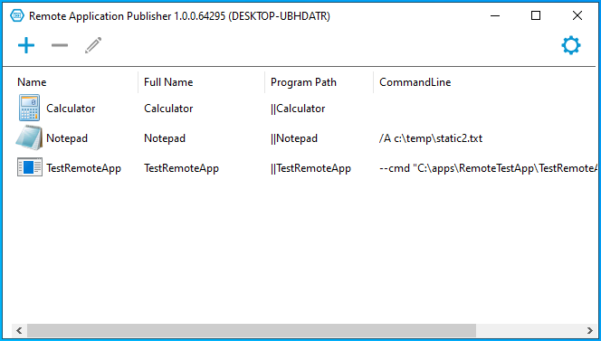
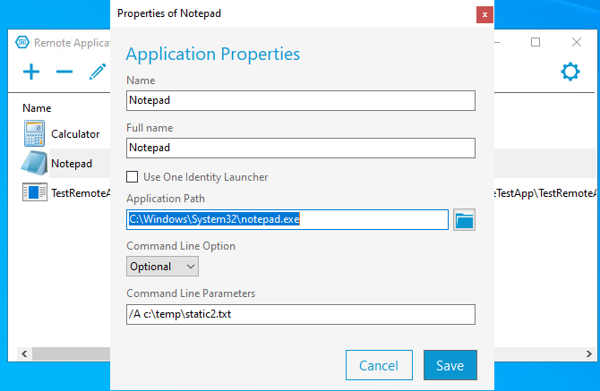
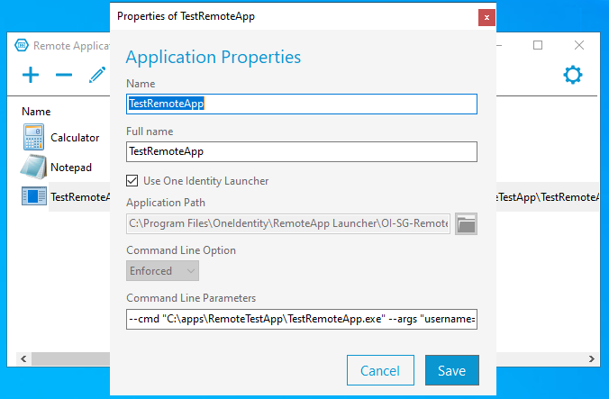
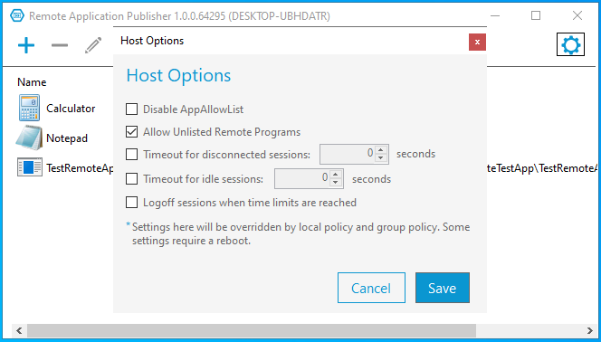
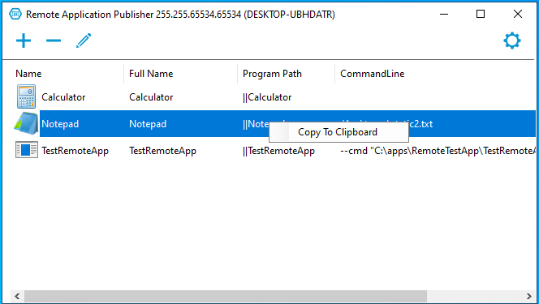
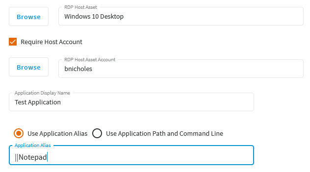

[](https://github.com/OneIdentity/RemoteApplicationPublisher/blob/main/LICENSE)

# Remote Application Publisher

The Remote Application Publisher is a tool that can be used to publish applications on Windows 10 Pro/Enterprise or a Windows Server to make the them available as remote applications. This tool was primarily written to help publish remote applications that can be launched as sessions using Safeguard for Privileged Passwords (SPP) (<https://www.oneidentity.com/one-identity-safeguard/>). SPP has the ability to launch a remote application, automatically inject login credentials directly from the vault and record all activity that takes place during the remote application session.

## How does the Remote Application Publisher work?

The Remote Application Publisher is a simple Windows desktop application. It adds and manages specific registry entries which Windows uses to identify applications which can be launched remotely. An application which has been published as a remote application, can be targeted specifically by a Remote Desktop Protocol (RDP) client. Once the application has been launched using the RDP client, the remote application appears on the client desktop as if it were running locally.

To publish an application as a remote application, several Windows registry entries have to be added. These registry entries can be found under:

```text
HKLM\SOFTWARE\Microsoft\Windows NT\CurrentVersion\Terminal Server\TSAppAllowList\Applications
```

Each remote application is added by name to the above registry folder. The name as it appears under the TSAppAllowList folder is also known as the application alias. An application alias when used in the RDP launch file, must be prefixed with || characters. In addition, the application entry must include specific values for the following keys:

* **CommandLineSetting** - Indicates how Windows will handle a command line that is provided in the RDP launch file.
  * 0 - Disable the command line.
  * 1 - Use the command line from the RDP file if it exists. Otherwise use any command line that is registered with the remote application registry entry.
  * 2 - Use the command line that is registered with the remote application entry.
* **Name** - Display name of the remote application.
* **Path** - Full path on the host to the remote application binary.
* **RequiredCommandLine** - Command line registered with the remote application.

In addition to the registry entries for each remote application, there are 2 global entries that must be set. These entries are registered under:

```text
HKLM\SOFTWARE\Policies\Microsoft\Windows NT\Terminal Services
```

* **fAllowUnlistedRemotePrograms**
  * 0 - Do not allow any remote application to be launched that is not included in the TSAppAllowList (see above).
  * 1 - Allow any applications to run as a remote application regardless of whether the application has been included in the TSAppAllowList.
    * The client may provide a full path to the remote application or use the application alias (name of the application as it appears in the TSAppAllowList prefixed with ```||```).
* **fEnableRemoteFXAdvancedRemoteApp** - Must be set to 0 to allow Safeguard for Privileged Sessions (SPS) and the One Identity remote application launcher to work correctly.

## Remote Application Publisher GUI

When the Remote Application Publisher is started, it will automatically open and read the Windows registry keys listed above, looking for any published remote applications. If these keys exist in the registry, the Remote Application Publisher will list the published applications on the main window.

There are 2 types of remote applications that can be published using the Remote Application Publisher. The first type is a standard application. This is an application that is intended to be run on it's own and cannot be launched as a session using SPP and recorded by SPS. A standard application is published by specifying the direct path to the application. The second type of remote application is an SPP/SPS compatible application. This type of application must be launched indirectly using the One Identity remote application launcher. The difference between a standard application and an SPP/SPS compatible application is how it is remotely launched. This will be seen on the configuration page.

There are 3 actions that can be performed from the main screen as well as certain settings which can be selected.

* To publish a new remote application, click on the ```+``` icon. This will display the file selection dialog which should be used to locate or specify the full path to the application binary.
* To remove a published application, select the application in the list and click on the ```-``` icon.
* To edit a currently published application, select the application from the list and click on the ```pencil``` icon.
* To backup the current registry setting for published remote applications or to set any of the global registry entries, click on the ```gear``` icon to the right.

|  |
|:--:|
| Remote Application Publisher main window.

When publishing a new remote application or editing an existing one, the configuration screen will be displayed. The following fields can be used to configure a remote application:

* **Name** - Name of the remote application as it will appear in the TSAppAllowList in the Windows registry and also as the application alias when prefixed with ```||``` characters.
* **Full Name** - Remote application display name.
* **Use One Identity Launcher** (checkbox) - When checked, the full path to the One Identity remote application launcher will automatically be entered as the ```Application Path```. The full path to the selected remote application will be moved to the ```Command Line Parameters``` along with a template for injecting credentials pulled from SPP.
* **Application Path** - Full path to the remote application.
* **Command Line Option** (dropdown) - Specifies how Windows will use the specified or registered command line (see ```CommandLineSetting``` registy entry above).
  * Disabled - Disable the command line.
  * Optional - Use the command line from the RDP file if it exists. Otherwise use any command line that is registered with the remote application entry.
  * Enforced - Use the command line that is registered with the remote application entry.
* **Command Line Parameters** - Command line parameters passed to the remote application.

|  |
|:--:|
| Standard remote application configuration. Direct path to binary.

Configuring an SPP/SPS compatible remote application requires that the application is launched using the One Identity remote application launcher. The launcher can be downloaded from the One Identity support web site under the latest One Identity Safeguard for Privileged Sessions product (<https://support.oneidentity.com/download-product-select>). Once the launcher has been installed on the host, publish the new remote application by selecting the appliation binary in the file selection dialog. Then on the configuration page, check the ```Use One Identity Launcher``` checkbox. The Remote Application Publisher will automatically fill in the ```Application Path``` with the path to the launcher and insert the application binary path as part of the command line template. Then finish the configuation by providing the ```Name```, ```Full Name``` and complete ```Command Line Parameters```.

|  |
|:--:|
| SPP/SPS compatible remote application configuration. Indirect path using the One Identity launcher.

Clicking on the ```gear``` icon to the right will display a context menu. There are 3 options in the menu which allows a backup of the currently published remote applications to be saved, display a Host Options dialog and display the About dialog.

The **Host Options** dialog set various registry entries which tells Windows how to handle remote applications. These options correspond to the following Windows registry entries. Please see the Microsoft documention for further information.

HKLM\SOFTWARE\Microsoft\Windows NT\CurrentVersion\Terminal Server\TSAppAllowList

* fDisabledAllowList
* fAllowUnlistedRemotePrograms
* MaxDisconnectionTime
* MaxIdleTime
* fResetBroken

|  |
|:--:|
| Global host options.

## Using the Remote Application Publisher for SPP remote application access policy configuration

When configuring an application to be launched remotely by SPP and recorded by SPS, there are specific parameters that must be set in the ```Security Policy Management/Entitlements/Access Request Policies/Security``` page in the SPP web interface. These parameters not only include the host and host account, they also include the Application ```Display Name```, ```Application Alias``` or ```Appliation Path``` and optionally an ```Application Command Line```. The Remote Application Publisher can help provide the appropriate values for these parameters by simply copying and pasting the values.

Values can be copied and pasted from the main window of the Remote Application Publisher by right mouse clicking on the appropriate value in the table. For example, to copy and paste the ```Application Alias``` or ```Program Path```, right click on the desired value in the table and select ```Copy to Clipboard``` in context menu. Then paste the value into the corresponding field in the SPP web interface.

|  |
|:--:|
| Copy a value from the Remote Application Publisher to the clipboard.

The copy and paste process can be repeated for any of the values required by SPP. By clicking on the ```Name```, ```Full Name```, ```Program Path``` or ```Command Line``` in the Remote Application Publisher table, any of these values can be copied to the clipboard.

|  |
|:--:|
| Paste the value into the SPP web interface.

## Contributing to the Remote Application Publisher

Is something broken or something that should be added to the Remote Application Publisher? [Log an issue](https://github.com/OneIdentity/RemoteApplicationPublisher/issues).
